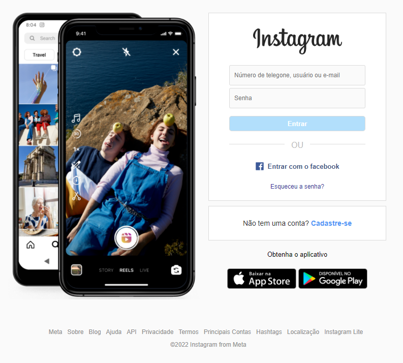
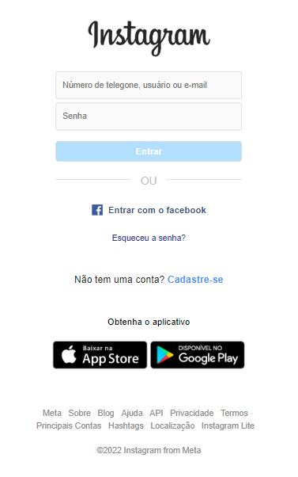

Você pode ler esse arquivo em Português clicando [aqui](./README.md)

# Instagram Login Page Clone :iphone:

This is a project where I cloned the Instagram login page. The main goal was to practice my web development skills, including HTML, CSS, and possibly JavaScript.

## Demo

Link to the online application: [Instagram Clone Demo](https://filipelimavaz-instagram-clone.netlify.app/)

## Technologies Used

- HTML
- CSS

## How to Use on Your Computer

1. Clone this repository to your local computer using `git clone https://github.com/your-username/clone-instagram-login`.
2. Open the `index.html` file in your web browser.

## Screenshots

1. Desktop Version

2. Mobile Version

