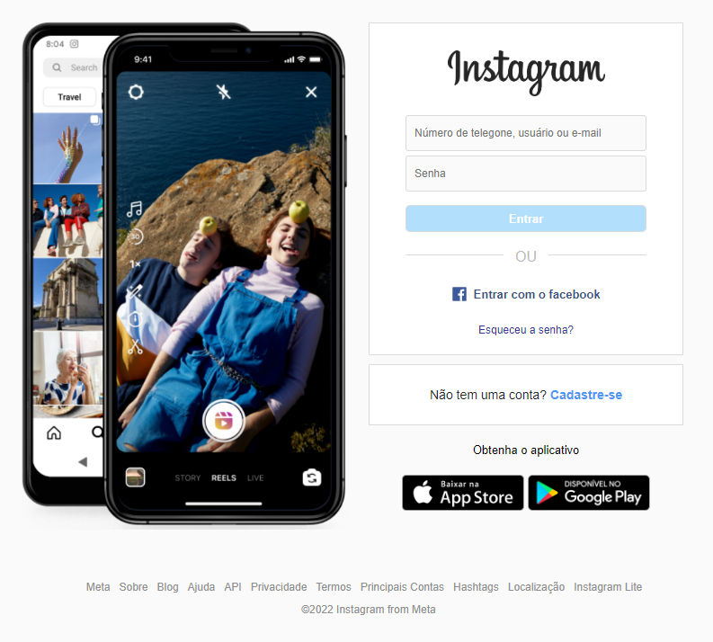
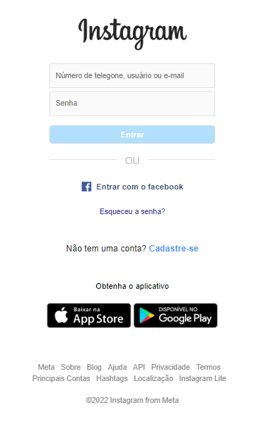

You can read this doc in english by clicking [here](./README-english.md) 

# Clone da Página de Login do Instagram :iphone:

Este é um projeto onde realizei a clonagem da página de login do Instagram. O objetivo principal foi praticar minhas habilidades em desenvolvimento web, incluindo HTML, CSS e possivelmente JavaScript.

## Demonstração

Link da aplicação online: https://filipelimavaz-instagram-clone.netlify.app/

## Tecnologias Utilizadas

- HTML
- CSS

## Como Usar no seu computador

1. Clone este repositório para o seu computador local usando `git clone https://github.com/seu-nome-de-usuario/clone-instagram-login`.
2. Abra o arquivo `index.html` em seu navegador web.

## Screenshots

1. Versão Desktop

2. Versão Mobile

